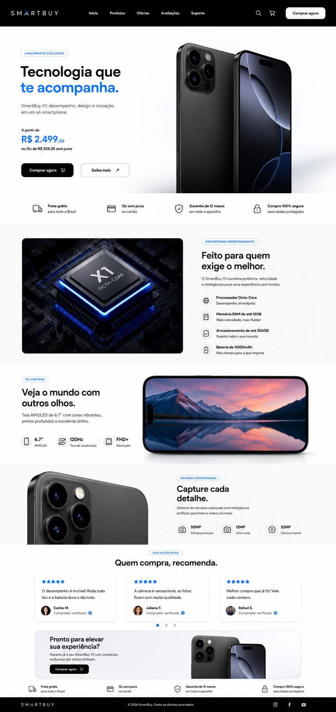

# 📱 Smarté – Landing Page de Smartphone

## 📖 Sobre o Projeto

Este projeto consiste em uma **Landing Page moderna e responsiva** para divulgação de um smartphone fictício, desenvolvida utilizando tecnologias web modernas.

### Tecnologias utilizadas

- 🌐 **HTML5**
- 🎨 **CSS3**
- ⚙️ **JavaScript (Vanilla)**

O desenvolvimento teve como foco as principais boas práticas do Front-End:

- ✅ HTML5 Semântico
- ♿ Acessibilidade (WCAG)
- 📱 Design Responsivo
- ⚡ Performance
- 🎨 Interface Moderna
- 🧠 Organização de Código
- 🔍 Manipulação do DOM
- 🚀 Boas práticas de UX

---

# 🚀 Como executar o projeto

## 1️⃣ Clonar o repositório

```bash
git clone https://github.com/seu-usuario/landing-page-smartphone.git
```

Ou faça o download do arquivo `.zip`.

---

## 2️⃣ Executar com servidor local (Recomendado)

Abra o projeto no **Visual Studio Code**.

### ▶️ Utilizando o Live Preview

1. Abra o **Visual Studio Code**
2. Clique em **Extensões**
3. Pesquise por **Live Preview**
4. Instale a extensão da **Microsoft**
5. Abra o arquivo `index.html`
6. Clique com o botão direito
7. Selecione **Open with Live Preview**
8. Aguarde o servidor iniciar
9. O projeto será aberto automaticamente
10. Caso prefira, utilize **Open in Browser**

---

> ⚠️ **Importante**
>
> Evite abrir o arquivo `index.html` diretamente no navegador, pois alguns recursos JavaScript, como `fetch` e módulos (`type="module"`), podem não funcionar corretamente devido às restrições do navegador.

---

# ✨ Funcionalidades

- 📱 Apresentação do smartphone
- 🖼️ Galeria de imagens
- 🎨 Layout moderno
- 📐 Design totalmente responsivo
- ⚡ Animações suaves
- 🎯 Botões de chamada para ação (CTA)
- 🌙 Interface intuitiva
- 🚀 Carregamento otimizado

---

# 📱 Responsividade

O projeto foi desenvolvido para proporcionar uma excelente experiência em diferentes dispositivos:

- 📲 Smartphones
- 📱 Tablets
- 💻 Notebooks
- 🖥️ Desktop

---

# ♿ Acessibilidade

O projeto segue diversas boas práticas de acessibilidade:

- HTML5 semântico
- Estrutura correta de títulos
- Imagens com atributo `alt`
- Navegação via teclado
- Contraste adequado
- Uso de atributos `aria-*` quando necessário
- Componentes acessíveis

---

# ⚡ Performance

Boas práticas aplicadas:

- Lazy Loading de imagens
- Código organizado
- CSS otimizado
- JavaScript modular
- Compressão de imagens
- Carregamento rápido

---

# 🛠️ Tecnologias Utilizadas

- HTML5
- CSS3
- JavaScript (ES6+)

---

# 📸 Preview

### 🚀 Conheça a Landing Page



---

# 💡 Objetivos do Projeto

Este projeto foi desenvolvido para praticar conceitos importantes do desenvolvimento Front-End, como:

- Estruturação semântica
- Organização de arquivos
- CSS moderno
- Flexbox
- CSS Grid
- Responsividade
- Performance
- Acessibilidade
- JavaScript moderno
- Experiência do usuário (UX)

---

# 👨‍💻 Autor

Projeto desenvolvido para fins de estudo, prática e aperfeiçoamento das habilidades em desenvolvimento Front-End.